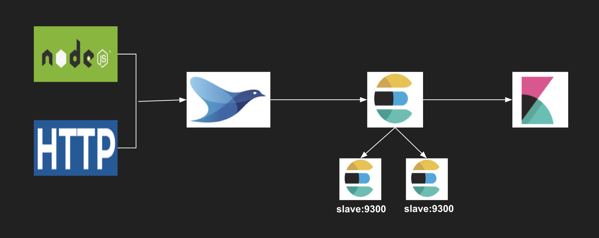

# EFK Pipeline

## Complete Architecture

## 이론

[Elastic Search 간단 이론](./documents/1.md)

## 1.Docker & Docker-compose 설치 Script

[Docker 설치 스크립트](./documents/2.md)

## 2. 구성

[Elastic Search Pipeline 구성](./documents/3.md)

## 3. Kibana 구성 활용

[Kibana 활용](./documents/4.md)

## ETC. Issue

[Issue 모음](./documents/issue.md)
