# EFK Pipeline


> Elastic RDB의 차이점 

| Elastic Search | RDB |
|-------|-------|
| 인덱스 | 데이터베이스 |
| 샤드 | 파티션 |
| 타입 | 테이블 |
| Document | 행 |
| 필드 | 열 |
| 매핑 | 스키마 |
| Query DSL | SQL |

> Elastic Search의 검색이 빠른이유 (Inverted Index)

- 기존의 DB 검색방식

```sh
    ## Colum 기준으로 Read
            ID  Text
    Read->  A   aaa
    Read->  B   bbb
    Read->  C   ccc
    Read->  D   ddd
```

- ES의 검색방식

```sh
ID  Text
A   hello a world
B   bye world
C   bye name
D   hello bye leedonggyu

## 역색인 생성 (구문분석을 통해서 다시 역색인 테이블로 정리한다)
Term        ID 
hello       A,D
world       A,B
bye         B,C,D
name        C
leedonggyu  D
a           A
```

- 장점 / 단점
    
    - 문서가 많아도 빠르게 검색 가능
    - 필요없는 단어의 경우 검색을 느려지게 만듬 (a, the, and, leedonggyu)
    - ***Stop Words 설정을 통해서 인덱스에서 제거, 검색어에 등장해도 무시 가능
    - 업데이트, 삭제 및 삽입의 대해서는 유지관리 비용이 큼

## Docker & Docker-compose 설치 Script

```sh
## update
sudo yum update -y

## docker
sudo yum install docker -y
sudo usermod -aG docker $USER
sudo newgrp docker
sudo systemctl restart docker

## docker-compose 
sudo curl -L https://github.com/docker/compose/releases/latest/download/docker-compose-$(uname -s)-$(uname -m) -o /usr/local/bin/docker-compose
sudo chmod +x /usr/local/bin/docker-compose
sudo ln -s /usr/local/bin/docker-compose /usr/bin/docker-compose ## symbolic 링크생성
```

## Nginx Revser Proxy

```sh
    ## curl localhost:9200
    ## curl localhost:9200/_cluster/health

 location /es/ {
    rewrite ^/es(/.*)$ $1 break;
    proxy_pass http://10.0.100.10:9200;
    proxy_set_header Host $host;
    proxy_set_header X-Real-IP $remote_addr;
    proxy_set_header X-Forwarded-For $proxy_add_x_forwarded_for;
    proxy_set_header X-Forwarded-Proto $scheme;
}
```

## Nginx SSL 설정 (certbot) 

```conf
user nginx;
worker_processes auto;
error_log /var/log/nginx/error.log;
pid /run/nginx.pid;

include /usr/share/nginx/modules/*.conf;

events {
    worker_connections 1024;
}

http {
    log_format  main  '$remote_addr - $remote_user [$time_local] "$request" '
                      '$status $body_bytes_sent "$http_referer" '
                      '"$http_user_agent" "$http_x_forwarded_for"';

    access_log  /var/log/nginx/access.log  main;

    sendfile            on;
    tcp_nopush          on;
    tcp_nodelay         on;
    keepalive_timeout   65;
    types_hash_max_size 4096;

    include             /etc/nginx/mime.types;
    default_type        application/octet-stream;

    include /etc/nginx/conf.d/*.conf;

    ## 80
    server {
        listen       80;
        listen       [::]:80;
        server_name  es.leedonggyu.com;
        root         /usr/share/nginx/html;

        if ($scheme != "https") {
            return 301 https://$host$request_uri;
        } # managed by Certbot

        return 404; # managed by Certbot

        # location /es/ {
        #     rewrite ^/es(/.*)$ $1 break;
        #     proxy_pass http://10.0.100.10:9200;
        #     proxy_set_header Host $host;
        #     proxy_set_header X-Real-IP $remote_addr;
        #     proxy_set_header X-Forwarded-For $proxy_add_x_forwarded_for;
        #     proxy_set_header X-Forwarded-Proto $scheme;
        # }
    }

    ## 443
    server {
        listen [::]:443 ssl ipv6only=on; # managed by Certbot
        listen 443 ssl; # managed by Certbot

        ssl_certificate /etc/letsencrypt/live/es.leedonggyu.com/fullchain.pem; # managed by Certbot
        ssl_certificate_key /etc/letsencrypt/live/es.leedonggyu.com/privkey.pem; # managed by Certbot

        include /etc/letsencrypt/options-ssl-nginx.conf; # managed by Certbot
        ssl_dhparam /etc/letsencrypt/ssl-dhparams.pem; # managed by Certbot
        server_name  es.leedonggyu.com;
        root         /usr/share/nginx/html;

        # Load configuration files for the default server block.
        include /etc/nginx/default.d/*.conf;

        error_page 404 /404.html;
        location = /404.html {
        }

        error_page 500 502 503 504 /50x.html;
        location = /50x.html {
        }

        location /es/ {
                rewrite ^/es(/.*)$ $1 break;
                proxy_pass http://10.0.100.10:9200;
                proxy_set_header Host $host;
                proxy_set_header X-Real-IP $remote_addr;
                proxy_set_header X-Forwarded-For $proxy_add_x_forwarded_for;
                proxy_set_header X-Forwarded-Proto $scheme;
        }
    }
}
```
- <a href="https://m.blog.naver.com/hsmang/221836126462"> Amazon Linux2 Nginx HTTPS </a> 

## Kibana use nginx Reverse Proxy

```sh
    ## kibana는 뒤에 / 붙히지 말자... 절대로...

    location / {
		proxy_pass http://10.0.100.10:5601;

		proxy_http_version 1.1;
		proxy_set_header Upgrade $http_upgrade;
		proxy_set_header Connection 'upgrade';
		proxy_set_header Host $host;
		proxy_cache_bypass $http_upgrade;
	}
```

## Elastic TLS 설정

- TLS 설정하기 위해 필요한 파일들 (added)
  - instances.yml => 인증서를 생성해야 하는 인스턴스를 식별하기 위한 파일
  - .env => 엘라스틱 버전과 인증서가 생성될 위치를 지정한 환경변수가 세팅되어있는 파일
  - create-certs.yml => 엘라스틱과 키바나를 위한 인증성 생성에 필요한 컨테이너

```sh
  ## es.docker-compose.yml
  instances:
  - name: es-master-1
    dns:
      - es-master-1
      - localhost
    ip:
      - 127.0.0.1

  - name: es-slave-1
    dns:  
      - es-slave-1
      - localhost
    ip:
      - 127.0.0.1
      
  - name: kibana
    dns:
      - kibana
      - localhost
```

```yml
  ## create-certs.yml
version: '3.8'

services:
  certs:
    image: docker.elastic.co/elasticsearch/elasticsearch:7.16.2
    container_name: create_certs
    command: >
      bash -c '
        apt-get update && apt-get install -y -q -e 0 unzip;
        if [[ ! -f /certs/bundle.zip ]]; then
          bin/elasticsearch-certutil cert --silent --pem --in config/certificates/instances.yml -out /certs/bundle.zip;
          unzip /certs/bundle.zip -d /certs;
        fi;
        chown -R 1000:0 /certs
      '
    working_dir: /usr/share/elasticsearch
    volumes:
      - ./instances.yml:/usr/share/elasticsearch/config/certificates/instances.yml
      - ./volumes/certs:/certs
      - ./volumes/:/usr/share/elasticsearch/config/certificates
```

- 실행순서

1. docker-compose -f create-certs.yml up (인증서 파일 생성)

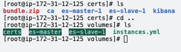

2. ES Docker-compose 파일 수정

```yml
... ## volumes
volumes:
      - ./volumes/es-slave-1:/usr/share/elasticsearch/data
      - ./volumes/certs:/usr/share/elasticsearch/config/certs ## config에 안놓으면 JAVA Permission Error 남..

...
xpack.security.enabled: true ## 보안기능 활성화 여부
xpack.security.transport.ssl.enabled: true
xpack.security.transport.ssl.verification_mode: certificate
xpack.security.transport.ssl.certificate_authorities: /usr/share/elasticsearch/certs/ca/ca.crt
xpack.security.transport.ssl.certificate: /usr/share/elasticsearch/certs/es-slave-1/es-slave-1.crt
xpack.security.transport.ssl.key: /usr/share/elasticsearch/certs/es-slave-1/es-slave-1.key
xpack.security.http.ssl.key: /usr/share/elasticsearch/config/certs/es-master-1/es-master-1.key
xpack.monitoring.collection.enabled: "false"
```


3. kibana.yml 수정

```yml
  ## kibana.docker-compose.yml
kibana:
    image: docker.elastic.co/kibana/kibana:7.16.2
    container_name: kibana
    ports:
      - "5601:5601"
    volumes:
      - ./volumes/certs:/usr/share/kibana/config/certs
      - ./kibana.yml:/usr/share/kibana/config/kibana.yml ## 추가
    environment:
      NODE_OPTIONS: "--max-old-space-size=2048" ## 2GB

  ## kibana.yml
  server.host: "0"
  server.name: kibana
  elasticsearch.hosts: ["http://es-master-1:9200"]
  server.port: 5601

  ## TLS
  server.ssl.enabled: true
  server.ssl.certificate: /usr/share/kibana/config/certs/kibana/kibana.crt
  server.ssl.key: /usr/share/kibana/config/certs/kibana/kibana.key
  elasticsearch.ssl.certificateAuthorities: [ "/usr/share/kibana/config/certs/ca/ca.crt" ]
  elasticsearch.ssl.verificationMode: certificate

  monitoring.ui.container.elasticsearch.enabled: true
```

4. ElasticSearch 패스워드 세팅

```sh
docker exec -it es-master-1 /bin/bash
cd bin
./elasticsearch-setup-passwords
```

## Stack Monitoring use MetricBeat

```yml
    ## es.docker-compose.yml
    metric-beat:
    image: docker.elastic.co/beats/metricbeat:7.16.2
    container_name: metricbeat
    environment:
      ELASTICSEARCH_HOSTS: http://es-master-1:9200
    restart: always
    volumes:
      - ./metricbeat.yml:/usr/share/metricbeat/metricbeat.yml
      - /var/run/docker.sock:/var/run/docker.sock/ro

    ## metricbeat.yml
    metricbeat.config.modules:
    enabled: true
    reload.enabled: true
    reload.period: 10s
    path: ${path.config}/modules.d/*.yml

    setup.dashboards.enabled: true
    setup.kibana.host: kibana:5601

    output.elasticsearch:
        hosts: ["es-master-1:9200"]

    metricbeat.modules:
    - module: elasticsearch
    xpack.enabled: true
    period: 10s
    hosts:
      [
        "http://es-master-1:9200",
        "http://es-slave-1:9200",
      ]
    - module: kibana
    xpack.enabled: true
    period: 10s
    hosts: ["http://kibana:5601"]
```

## Kibana Dashboard Tools (Document API)

```
## GET Index
GET dg_index/_doc
GET dg_index/_doc/1
GET dg_index/_doc/2
GET dg_index/_doc/3

## DELETE Index
DELETE dg_index/_doc/1  ## 1번의 Data를 삭제
DELETE dg_index/_doc    ## Document를 삭제
DELETE dg_index         ## Index를 아예 삭제

## Post Index
POST dg_index/_update/1
{
  "doc" : {
    "age" : 100
  }
}

## 다중 Request
POST _bulk
{"index" : {"_index" : "dg_index", "_id" : "2"}}
{"name" : "leedonggyu-2", "age": 31, "job": "SRE"}
{"update" : {"_index" : "dg_index", "_id" : "1"}}
{"doc": {"age": 100}}
{"delete" : {"_index" : "dg_index", "_id" : "1"}}
{"index" : {"_index" : "dg_index", "_id" : "3"}}
{"name" : "someone-else", "age": 25, "job": "Engineer"}

## Reindex API
## A Index에서 B Index Copy

POST dg-one/_doc/1
{"name" : "leedonggyu", "age" : 32, "job" : "devops"}

POST dg-one/_doc/2
{"name" : "leedonggyu", "age" : 32, "job" : "sre"}

POST dg-one/_doc/3
{"name" : "leedonggyu", "age" : 33, "job" : "devsecops"}

GET dg-one/_doc/3

POST dg-one/_search
{
  "query": {
    "query_string": {
      "query": "job:devops OR job:sre OR job:devsecops"
    }
  }
}

POST dg-one/_search
{
  "query": {
    "range": {
      "age": {
        "gte": 31,
        "lte": 40
      }
    }
  }
}
```

## Kibana Dashbard Tools (use ecommerce Example Data)

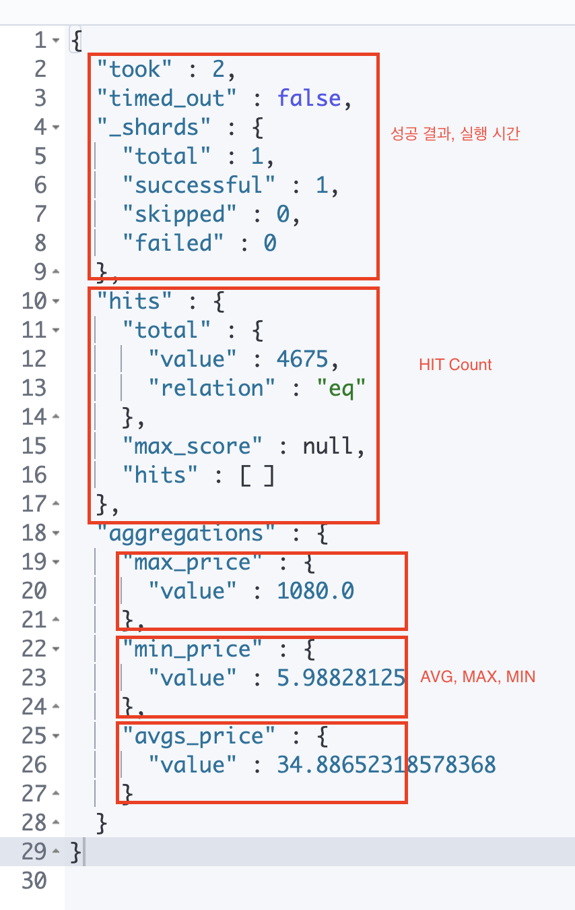

```
GET kibana_sample_data_ecommerce/_search
GET kibana_sample_data_ecommerce/_mapping

GET kibana_sample_data_ecommerce/_search
{
  "size" : 0,
  "aggs": {
    "avgs_price" : {
      "avg" : {
        "field" : "products.base_price"
      }
    },
    "max_price" : {
      "max" : {
        "field" : "products.base_price"
      }
    },
    "min_price" : {
      "min" : {
        "field" : "products.base_price"
      }
    }
  }
}

GET kibana_sample_data_ecommerce/_search
{
  "size" : 0,
  "aggs": {
    "stats_base_price" : {
      "stats" : {
        "field" : "products.base_price"
      }
    }
  }
}

## customer_gender는 MALE에 base_price의 통계
GET kibana_sample_data_ecommerce/_search
{
  "query" : {
    "match" : {
      "customer_gender" : "MALE"
    }
  },
  "size" : 0,
  "aggs": {
    "stats_base_price" : {
      "stats" : {
        "field" : "products.base_price"
      }
    }
  }
}

## category의 호출횟수
GET kibana_sample_data_ecommerce/_search
{
  "size" : 0,
  "aggs" : {
    "category_count" : {
      "terms": {
        "field": "products.category.keyword"
      }
    }
  }
}
```

- <a href="https://www.elastic.co/guide/en/elasticsearch/reference/7.10/search-search.html#search-search-api-path-params"> Elastic API Search Params </a>

## Fluentd to ElasticSearch

### Fluentd 구성

```sh
    ## Dockerfile
FROM fluentd:latest

USER root
RUN gem install fluent-plugin-elasticsearch
USER fluent
```

### fluentd.conf

```conf
<source>
  @type forward
  port 24224
  bind 0.0.0.0
</source>

<source>
  @type http
  port 9800
  bind 0.0.0.0
  cors_allow_origins ["*"]
</source>

<match dg.**>
  @type copy
  <store>
    @type elasticsearch
    host 10.0.100.10
    port 9200
    logstash_format true
    logstash_prefix fluentd
    logstash_dateformat %Y%m%d
    include_tag_key true
    tag_key @log_name
    flush_interval 1s
  </store>
  <store>
    @type stdout
    format json
  </store>
</match>
```

### fluentd에서 명령어 사용

```
curl -X PUT -H 'Content-Type: application/json' -d '{"name":"이동규","age":31, "job":"devops"}' http://localhost:9800/es

curl -X PUT -H 'Content-Type: application/json' -d '{"name":"임재혁","age":30, "job":"frontend"}' http://localhost:9800/es

curl -X PUT -H 'Content-Type: application/json' -d '{"name":"신정현","age":30, "job":"police"}' http://localhost:9800/es

curl -X PUT -H 'Content-Type: application/json' -d '{"name":"김현철","age":30, "job":"police"}' http://localhost:9800/es
```

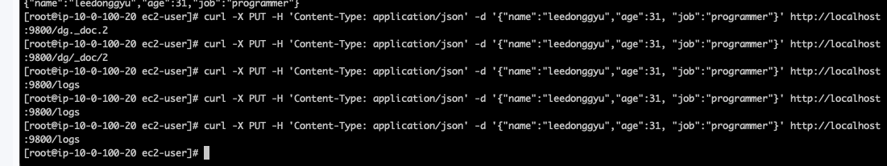
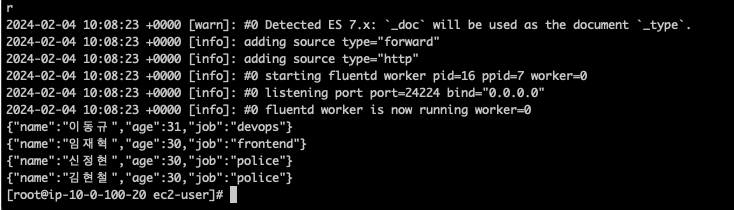

### ElasticSearch에서 확인
    
- Fluentd-* 형태로 쌓인다.. (파일형태로)

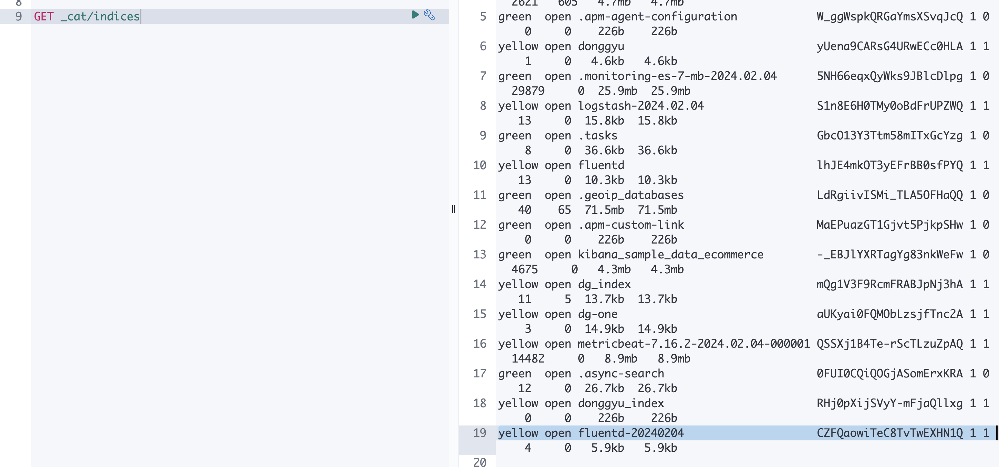
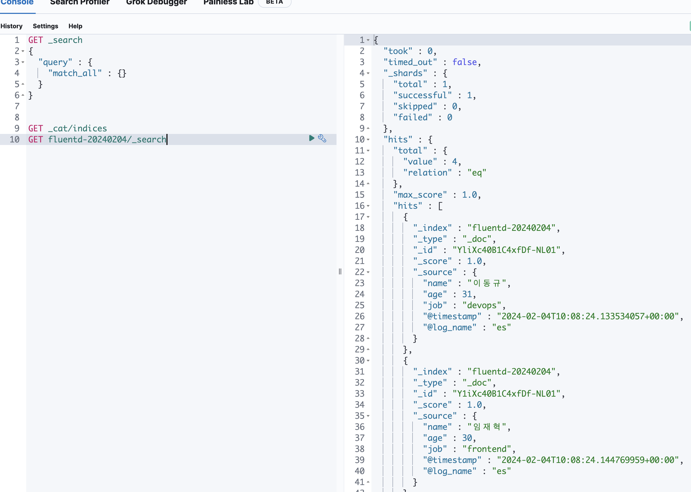

### ES Discover에서 활용하기

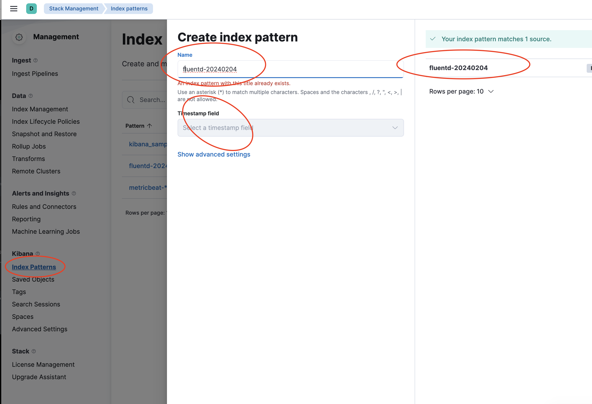
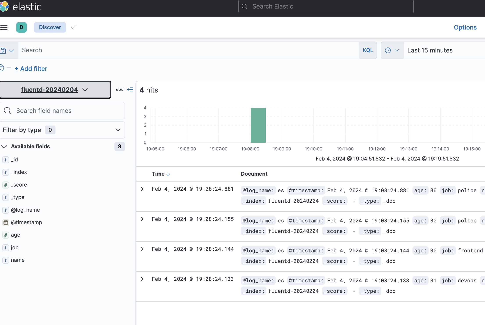

## 데이터분석) ES **(Analyzer , Tokenizer)

- Tokenizer 
    - 해당 단어를 분리하는 작업을 수행
    - 공백, ", . /" 등을 기준으로 토큰을 분리
    - 각 단어의 순서, 해당 단어의 시작과 끝자리의 offset을 기록


```sh
    ## install
    bin/elasticsearch-plugin install analysis-nori
    bin/elasticsearch-plugin remove analysis-nori

    ## docker-compose 구동 (좋은 방법을 찾지 못함)
    docker-compose up -d

    ## 각 노드별로 접속해서 nori plugin
    docker exec -it es01 bash
    bin/elasticsearch-plugin install analysis-nori
    docker restart [...] ## 모두 재시작...
```

```
GET _analyze
{
  "tokenizer" : "standard",
  "text" : [
    "안녕, 나는 이동규야 반갑다"
  ]
}

GET _analyze 
{
  "tokenizer": "nori_tokenizer",
  "text" : [
    "안녕, 나는 이동규야 반갑다"
  ],
  "explain": true
}
```

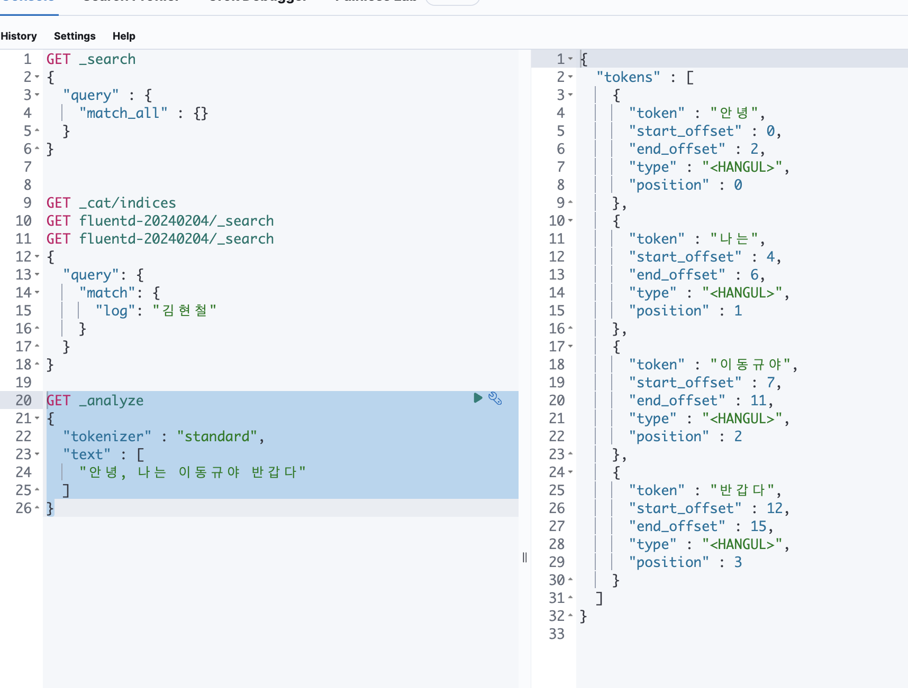
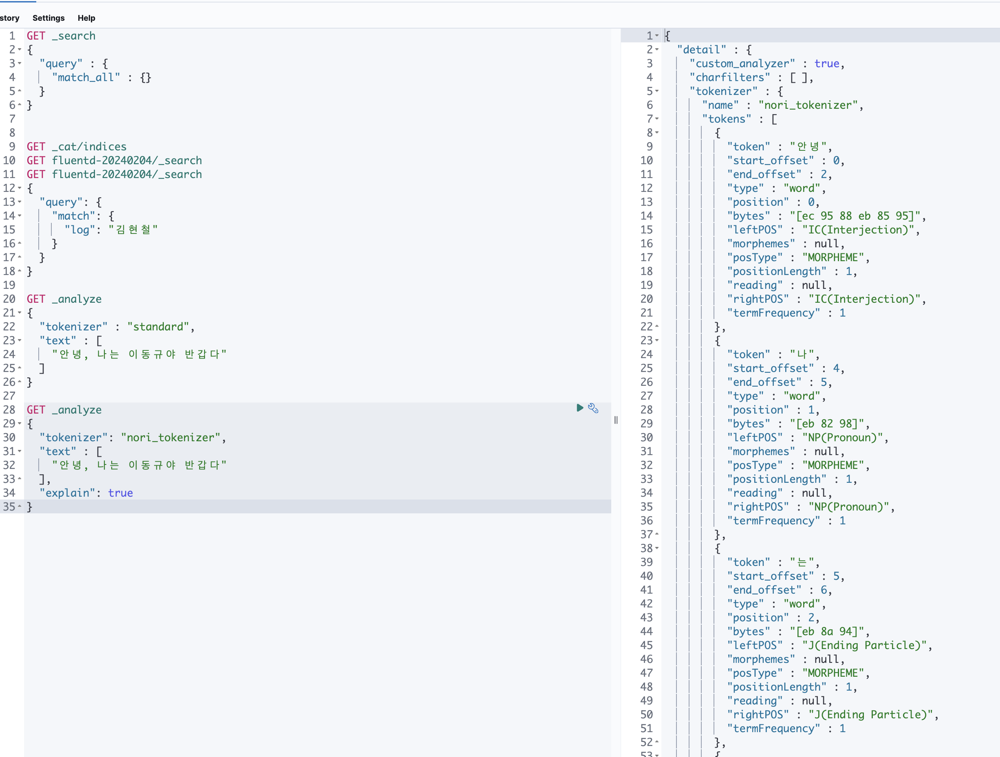

## 데이터분석) 원하지 않은 품사 제거 

```sh
## example_stop_filter를 만드는데 -> IC를 제거한다..
## IC => 감탄사를 정의...
PUT example_pos
{
  "settings" : {
    "index" : {
      "analysis" : {
        "filter" : {
          "example_stop_filter": {
            "type" : "nori_part_of_speech",
            "stoptags" : [
              "IC"
            ]
          }
        }
      }
    }
  }
}

GET example_pos/_analyze
{
  "tokenizer": "nori_tokenizer",
  "filter" : [
    "example_stop_filter"
  ],
  "text" : "우와 재밌네요"
}

```

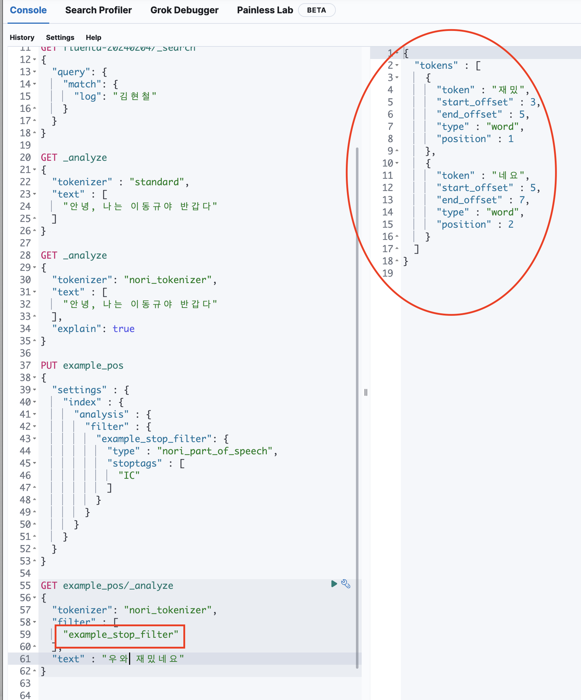

## 데이터분석) 하나의 단어 취급하기

```

PUT dg_pos
{
  "settings" : {
      "analysis" : {
        "tokenizer": {
          "my_nori_filter": {
            "type" : "nori_tokenizer",
            "user_dictionary_rules" : [
              "존나"
          ]
        }
      }
    }
  }
}

GET dg_pos/_analyze
{
  "tokenizer": "nori_tokenizer",
  "text" : "존나재밌네요"
}
```


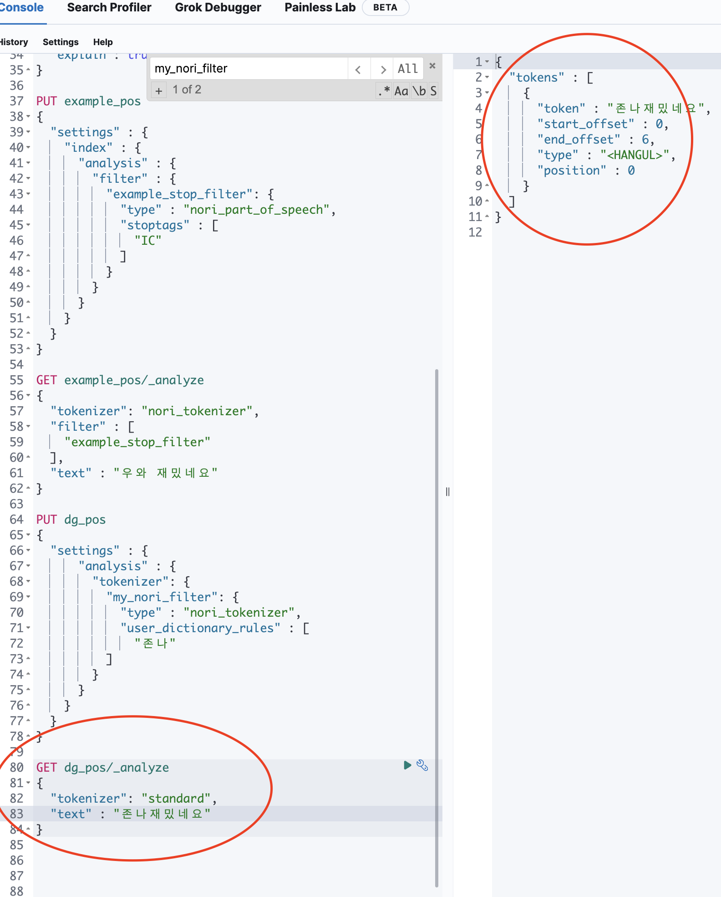
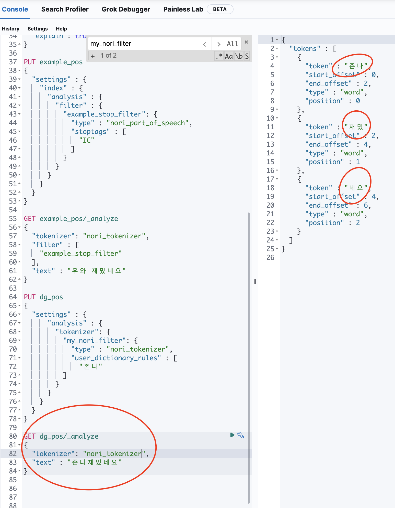