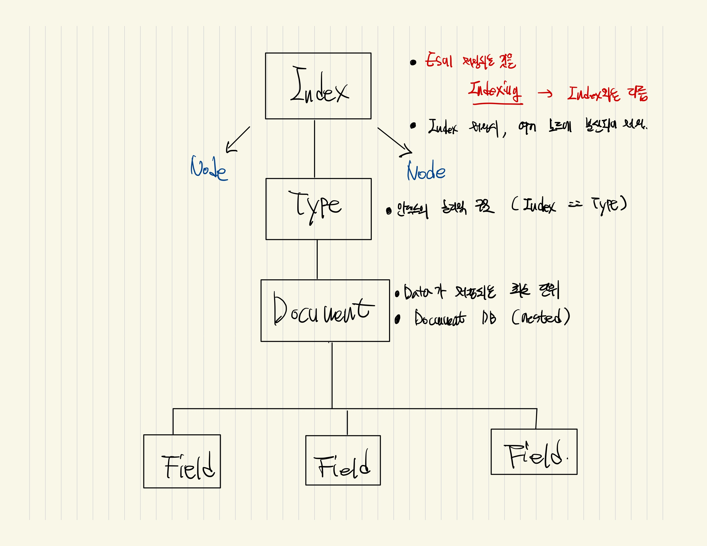
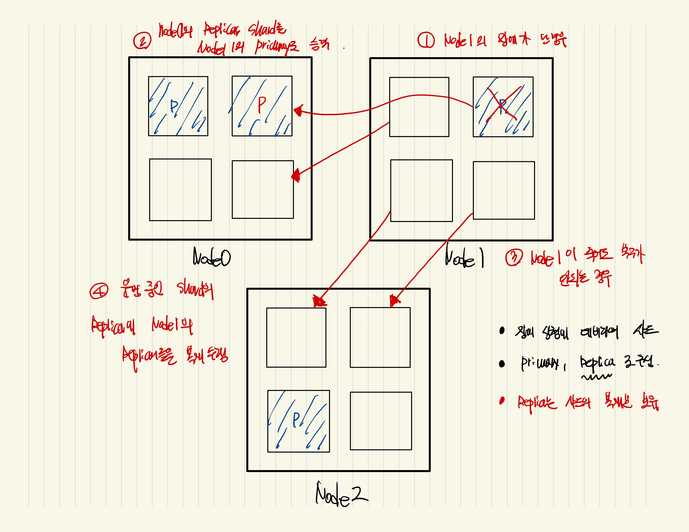
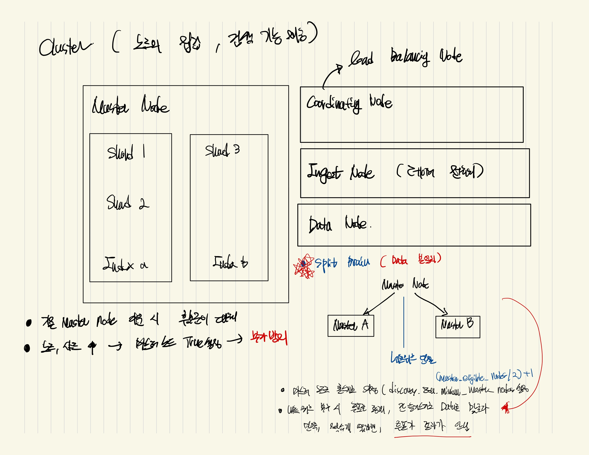

# EFK Pipeline





> Elastic RDB의 차이점 

| Elastic Search | RDB |
|-------|-------|
| 인덱스 | 데이터베이스 |
| 샤드 | 파티션 |
| 타입 | 테이블 |
| Document | 행 |
| 필드 | 열 |
| 매핑 | 스키마 |
| Query DSL | SQL |

> Elastic Search의 검색이 빠른이유 (Inverted Index)

- 기존의 DB 검색방식

```sh
    ## Colum 기준으로 Read
            ID  Text
    Read->  A   aaa
    Read->  B   bbb
    Read->  C   ccc
    Read->  D   ddd
```

- ES의 검색방식

```sh
ID  Text
A   hello a world
B   bye world
C   bye name
D   hello bye leedonggyu

## 역색인 생성 (구문분석을 통해서 다시 역색인 테이블로 정리한다)
Term        ID 
hello       A,D
world       A,B
bye         B,C,D
name        C
leedonggyu  D
a           A
```

- 장점 / 단점
    
    - 문서가 많아도 빠르게 검색 가능
    - 필요없는 단어의 경우 검색을 느려지게 만듬 (a, the, and, leedonggyu)
    - ***Stop Words 설정을 통해서 인덱스에서 제거, 검색어에 등장해도 무시 가능
    - 업데이트, 삭제 및 삽입의 대해서는 유지관리 비용이 큼

## Docker & Docker-compose 설치 Script

```sh
## update
sudo yum update -y

## docker
sudo yum install docker -y
sudo usermod -aG docker $USER
sudo newgrp docker
sudo systemctl restart docker

## docker-compose 
sudo curl -L https://github.com/docker/compose/releases/latest/download/docker-compose-$(uname -s)-$(uname -m) -o /usr/local/bin/docker-compose
sudo chmod +x /usr/local/bin/docker-compose
sudo ln -s /usr/local/bin/docker-compose /usr/bin/docker-compose ## symbolic 링크생성
```

## Nginx Revser Proxy

```sh
    ## curl localhost:9200
    ## curl localhost:9200/_cluster/health

 location /es/ {
    rewrite ^/es(/.*)$ $1 break;
    proxy_pass http://10.0.100.10:9200;
    proxy_set_header Host $host;
    proxy_set_header X-Real-IP $remote_addr;
    proxy_set_header X-Forwarded-For $proxy_add_x_forwarded_for;
    proxy_set_header X-Forwarded-Proto $scheme;
}
```

## Nginx SSL 설정 (certbot) 

```conf
user nginx;
worker_processes auto;
error_log /var/log/nginx/error.log;
pid /run/nginx.pid;

include /usr/share/nginx/modules/*.conf;

events {
    worker_connections 1024;
}

http {
    log_format  main  '$remote_addr - $remote_user [$time_local] "$request" '
                      '$status $body_bytes_sent "$http_referer" '
                      '"$http_user_agent" "$http_x_forwarded_for"';

    access_log  /var/log/nginx/access.log  main;

    sendfile            on;
    tcp_nopush          on;
    tcp_nodelay         on;
    keepalive_timeout   65;
    types_hash_max_size 4096;

    include             /etc/nginx/mime.types;
    default_type        application/octet-stream;

    include /etc/nginx/conf.d/*.conf;

    ## 80
    server {
        listen       80;
        listen       [::]:80;
        server_name  es.leedonggyu.com;
        root         /usr/share/nginx/html;

        if ($scheme != "https") {
            return 301 https://$host$request_uri;
        } # managed by Certbot

        return 404; # managed by Certbot

        # location /es/ {
        #     rewrite ^/es(/.*)$ $1 break;
        #     proxy_pass http://10.0.100.10:9200;
        #     proxy_set_header Host $host;
        #     proxy_set_header X-Real-IP $remote_addr;
        #     proxy_set_header X-Forwarded-For $proxy_add_x_forwarded_for;
        #     proxy_set_header X-Forwarded-Proto $scheme;
        # }
    }

    ## 443
    server {
        listen [::]:443 ssl ipv6only=on; # managed by Certbot
        listen 443 ssl; # managed by Certbot

        ssl_certificate /etc/letsencrypt/live/es.leedonggyu.com/fullchain.pem; # managed by Certbot
        ssl_certificate_key /etc/letsencrypt/live/es.leedonggyu.com/privkey.pem; # managed by Certbot

        include /etc/letsencrypt/options-ssl-nginx.conf; # managed by Certbot
        ssl_dhparam /etc/letsencrypt/ssl-dhparams.pem; # managed by Certbot
        server_name  es.leedonggyu.com;
        root         /usr/share/nginx/html;

        # Load configuration files for the default server block.
        include /etc/nginx/default.d/*.conf;

        error_page 404 /404.html;
        location = /404.html {
        }

        error_page 500 502 503 504 /50x.html;
        location = /50x.html {
        }

        location /es/ {
                rewrite ^/es(/.*)$ $1 break;
                proxy_pass http://10.0.100.10:9200;
                proxy_set_header Host $host;
                proxy_set_header X-Real-IP $remote_addr;
                proxy_set_header X-Forwarded-For $proxy_add_x_forwarded_for;
                proxy_set_header X-Forwarded-Proto $scheme;
        }
    }
}
```
- <a href="https://m.blog.naver.com/hsmang/221836126462"> Amazon Linux2 Nginx HTTPS </a>