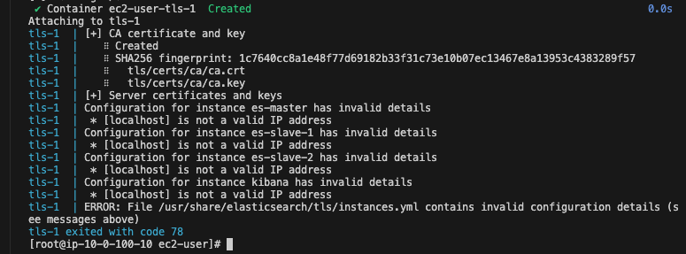
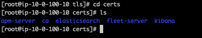

# 2. 구성

## nginx reverse proxy 설정

```sh
    ## curl localhost:9200
    ## curl localhost:9200/_cluster/health

 location /es/ {
    rewrite ^/es(/.*)$ $1 break;
    proxy_pass http://10.0.100.10:9200;
    proxy_set_header Host $host;
    proxy_set_header X-Real-IP $remote_addr;
    proxy_set_header X-Forwarded-For $proxy_add_x_forwarded_for;
    proxy_set_header X-Forwarded-Proto $scheme;
}
```
## nginx ssl 설정 (certbot)

```conf
user nginx;
worker_processes auto;
error_log /var/log/nginx/error.log;
pid /run/nginx.pid;

include /usr/share/nginx/modules/*.conf;

events {
    worker_connections 1024;
}

http {
    log_format  main  '$remote_addr - $remote_user [$time_local] "$request" '
                      '$status $body_bytes_sent "$http_referer" '
                      '"$http_user_agent" "$http_x_forwarded_for"';

    access_log  /var/log/nginx/access.log  main;

    sendfile            on;
    tcp_nopush          on;
    tcp_nodelay         on;
    keepalive_timeout   65;
    types_hash_max_size 4096;

    include             /etc/nginx/mime.types;
    default_type        application/octet-stream;

    include /etc/nginx/conf.d/*.conf;

    ## 80
    server {
        listen       80;
        listen       [::]:80;
        server_name  es.leedonggyu.com;
        root         /usr/share/nginx/html;

        if ($scheme != "https") {
            return 301 https://$host$request_uri;
        } # managed by Certbot

        return 404; # managed by Certbot

        # location /es/ {
        #     rewrite ^/es(/.*)$ $1 break;
        #     proxy_pass http://10.0.100.10:9200;
        #     proxy_set_header Host $host;
        #     proxy_set_header X-Real-IP $remote_addr;
        #     proxy_set_header X-Forwarded-For $proxy_add_x_forwarded_for;
        #     proxy_set_header X-Forwarded-Proto $scheme;
        # }
    }

    ## 443
    server {
        listen [::]:443 ssl ipv6only=on; # managed by Certbot
        listen 443 ssl; # managed by Certbot

        ssl_certificate /etc/letsencrypt/live/es.leedonggyu.com/fullchain.pem; # managed by Certbot
        ssl_certificate_key /etc/letsencrypt/live/es.leedonggyu.com/privkey.pem; # managed by Certbot

        include /etc/letsencrypt/options-ssl-nginx.conf; # managed by Certbot
        ssl_dhparam /etc/letsencrypt/ssl-dhparams.pem; # managed by Certbot
        server_name  es.leedonggyu.com;
        root         /usr/share/nginx/html;

        # Load configuration files for the default server block.
        include /etc/nginx/default.d/*.conf;

        error_page 404 /404.html;
        location = /404.html {
        }

        error_page 500 502 503 504 /50x.html;
        location = /50x.html {
        }

        location /es/ {
                rewrite ^/es(/.*)$ $1 break;
                proxy_pass http://10.0.100.10:9200;
                proxy_set_header Host $host;
                proxy_set_header X-Real-IP $remote_addr;
                proxy_set_header X-Forwarded-For $proxy_add_x_forwarded_for;
                proxy_set_header X-Forwarded-Proto $scheme;
        }
    }
}
```
- <a href="https://m.blog.naver.com/hsmang/221836126462"> Amazon Linux2 Nginx HTTPS </a> 

## Kibana Reverse Proxy 설정

```sh
    ## kibana는 뒤에 / 붙히지 말자... 절대로...

    location / {
		proxy_pass http://10.0.100.10:5601;

		proxy_http_version 1.1;
		proxy_set_header Upgrade $http_upgrade;
		proxy_set_header Connection 'upgrade';
		proxy_set_header Host $host;
		proxy_cache_bypass $http_upgrade;
	}
```

## Elastic Search TLS 설정

### 1. TLS CA key 생성

- TLS 설정을 진행하기전에 instnaces.yml을 사용하여 각각의 구성환경을 진행
- 일단 용량상... master-1, slave-1, kibana로 구성하기로 함 (t4g.medium)




```sh
    ## TLS 설정
    cd efk-pipeline
    sudo chmod 777 cert.sh 

    ## TLS키를 만들고 알아서 docker-compose 실행
    ## ./cert.sh <password>
    ./cert.sh "qlalfqjsgh486" 
``````