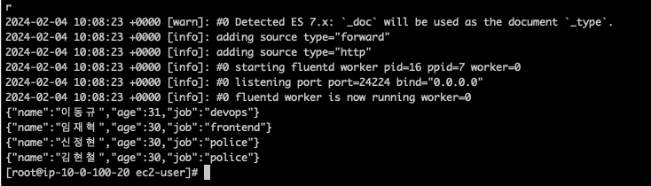
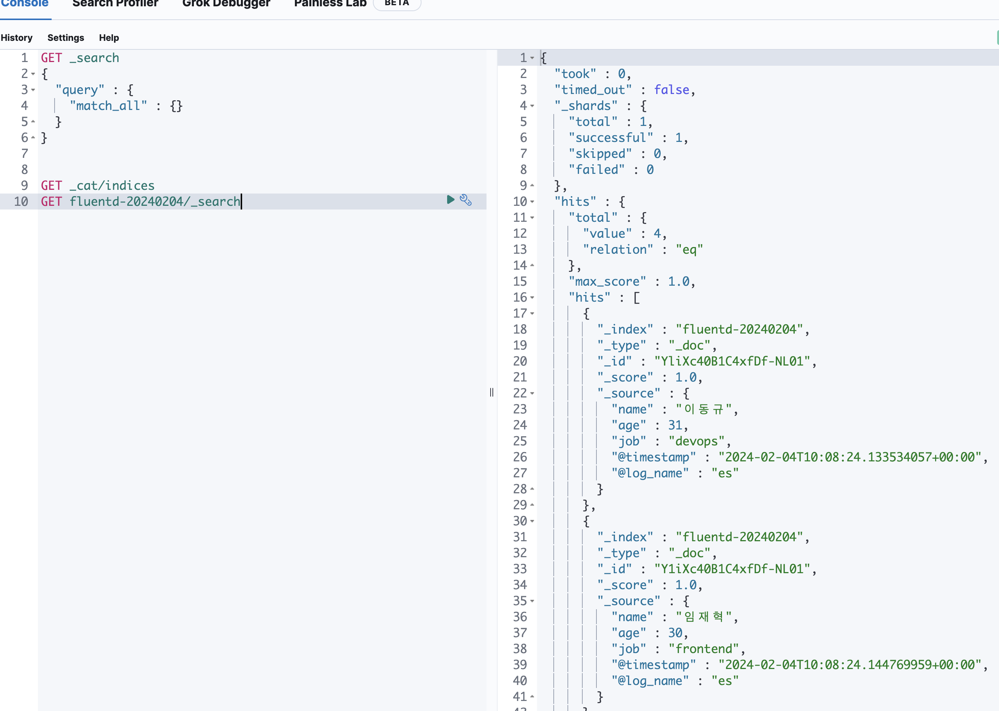
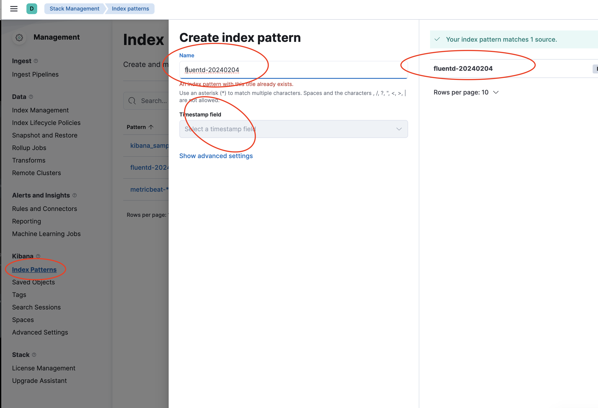
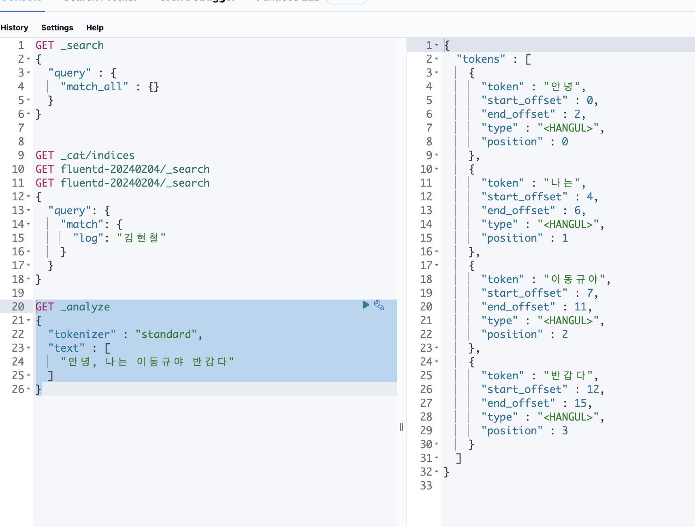
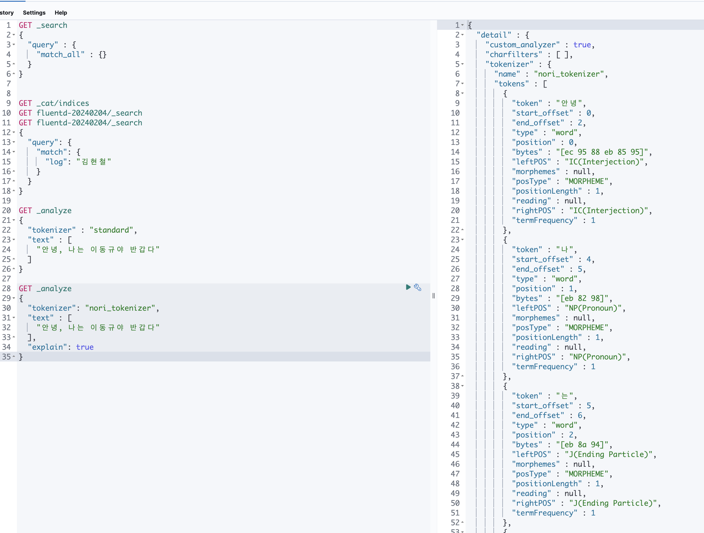
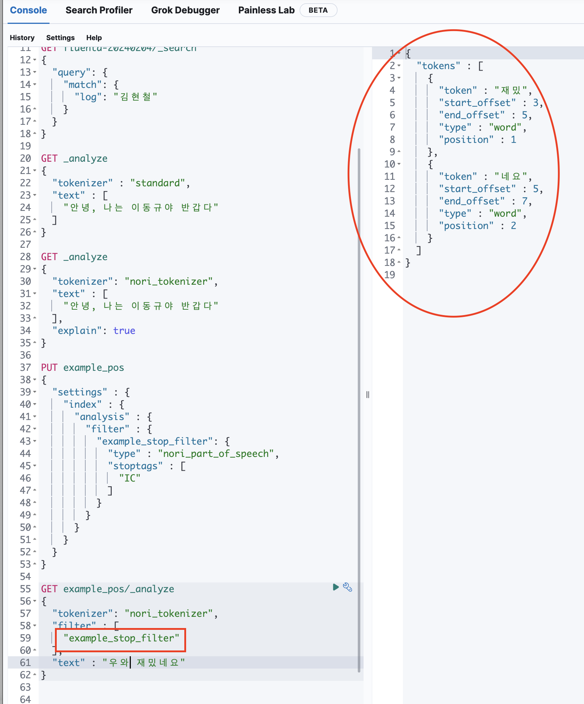
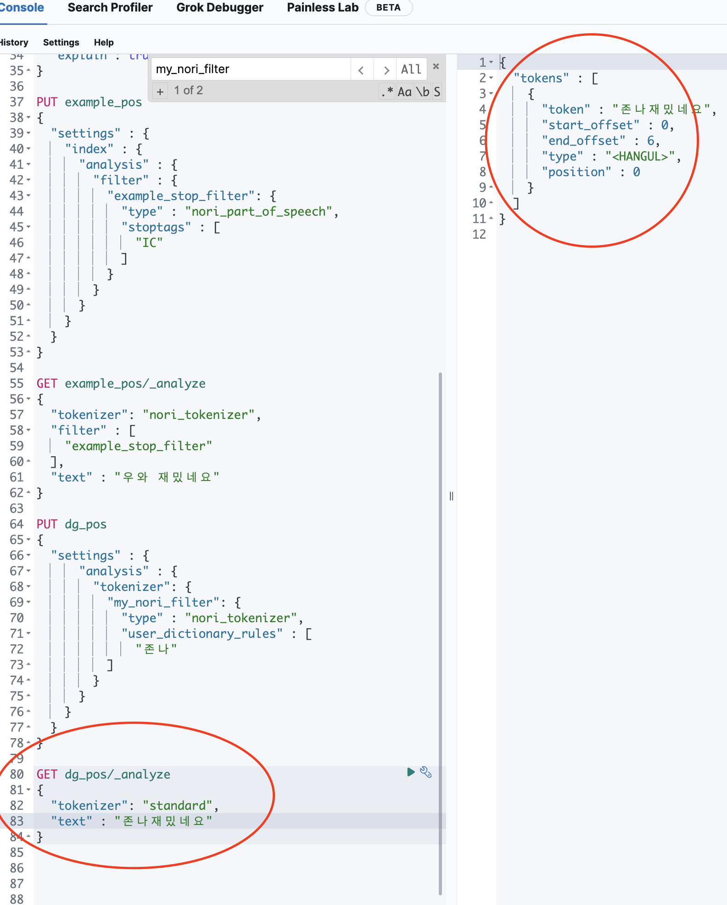
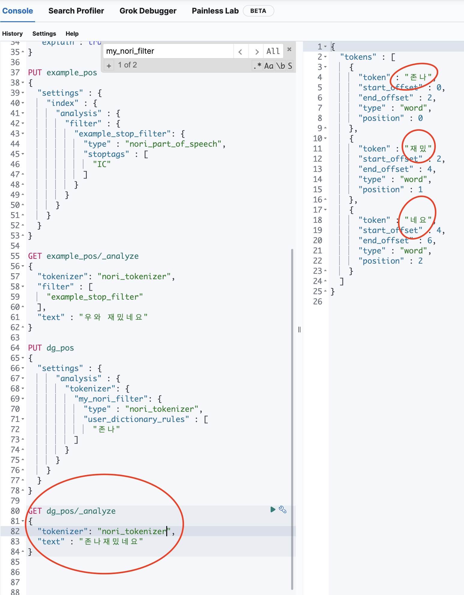

# 3. Kibana 구성 활용

```sh
## GET Index

GET dg_index/_doc
GET dg_index/_doc/1
GET dg_index/_doc/2
GET dg_index/_doc/3

## DELETE Index

DELETE dg_index/_doc/1  ## 1번의 Data를 삭제
DELETE dg_index/_doc    ## Document를 삭제
DELETE dg_index         ## Index를 아예 삭제

## Post Index

POST dg_index/_update/1
{
  "doc" : {
    "age" : 100
  }
}

## 다중 Request
POST _bulk
{"index" : {"_index" : "dg_index", "_id" : "2"}}
{"name" : "leedonggyu-2", "age": 31, "job": "SRE"}
{"update" : {"_index" : "dg_index", "_id" : "1"}}
{"doc": {"age": 100}}
{"delete" : {"_index" : "dg_index", "_id" : "1"}}
{"index" : {"_index" : "dg_index", "_id" : "3"}}
{"name" : "someone-else", "age": 25, "job": "Engineer"}

## Reindex API
## A Index에서 B Index Copy

POST dg-one/_doc/1
{"name" : "leedonggyu", "age" : 32, "job" : "devops"}

POST dg-one/_doc/2
{"name" : "leedonggyu", "age" : 32, "job" : "sre"}

POST dg-one/_doc/3
{"name" : "leedonggyu", "age" : 33, "job" : "devsecops"}

GET dg-one/_doc/3

POST dg-one/_search
{
  "query": {
    "query_string": {
      "query": "job:devops OR job:sre OR job:devsecops"
    }
  }
}

POST dg-one/_search
{
  "query": {
    "range": {
      "age": {
        "gte": 31,
        "lte": 40
      }
    }
  }
}
```

## Kibana Dashbard Tools (use ecommerce Example Data)


```
GET kibana_sample_data_ecommerce/_search
GET kibana_sample_data_ecommerce/_mapping

GET kibana_sample_data_ecommerce/_search
{
  "size" : 0,
  "aggs": {
    "avgs_price" : {
      "avg" : {
        "field" : "products.base_price"
      }
    },
    "max_price" : {
      "max" : {
        "field" : "products.base_price"
      }
    },
    "min_price" : {
      "min" : {
        "field" : "products.base_price"
      }
    }
  }
}

GET kibana_sample_data_ecommerce/_search
{
  "size" : 0,
  "aggs": {
    "stats_base_price" : {
      "stats" : {
        "field" : "products.base_price"
      }
    }
  }
}

## customer_gender는 MALE에 base_price의 통계
GET kibana_sample_data_ecommerce/_search
{
  "query" : {
    "match" : {
      "customer_gender" : "MALE"
    }
  },
  "size" : 0,
  "aggs": {
    "stats_base_price" : {
      "stats" : {
        "field" : "products.base_price"
      }
    }
  }
}

## category의 호출횟수
GET kibana_sample_data_ecommerce/_search
{
  "size" : 0,
  "aggs" : {
    "category_count" : {
      "terms": {
        "field": "products.category.keyword"
      }
    }
  }
}
```

- <a href="https://www.elastic.co/guide/en/elasticsearch/reference/7.10/search-search.html#search-search-api-path-params"> Elastic API Search Params </a>

## Fluentd to ElasticSearch

### Fluentd 구성

```sh
    ## Dockerfile
FROM fluentd:latest

USER root
RUN gem install fluent-plugin-elasticsearch
USER fluent
```

### fluentd.conf

```conf
<source>
  @type forward
  port 24224
  bind 0.0.0.0
</source>

<source>
  @type http
  port 9800
  bind 0.0.0.0
  cors_allow_origins ["*"]
</source>

<match dg.**>
  @type copy
  <store>
    @type elasticsearch
    host 10.0.100.10
    port 9200
    logstash_format true
    logstash_prefix fluentd
    logstash_dateformat %Y%m%d
    include_tag_key true
    tag_key @log_name
    flush_interval 1s
  </store>
  <store>
    @type stdout
    format json
  </store>
</match>
```

### fluentd에서 명령어 사용

```
curl -X PUT -H 'Content-Type: application/json' -d '{"name":"이동규","age":31, "job":"devops"}' http://localhost:9800/es

curl -X PUT -H 'Content-Type: application/json' -d '{"name":"임재혁","age":30, "job":"frontend"}' http://localhost:9800/es

curl -X PUT -H 'Content-Type: application/json' -d '{"name":"신정현","age":30, "job":"police"}' http://localhost:9800/es

curl -X PUT -H 'Content-Type: application/json' -d '{"name":"김현철","age":30, "job":"police"}' http://localhost:9800/es
```




### ElasticSearch에서 확인
    
- Fluentd-* 형태로 쌓인다.. (파일형태로)




### ES Discover에서 활용하기




## 데이터분석) ES **(Analyzer , Tokenizer)

- Tokenizer 
    - 해당 단어를 분리하는 작업을 수행
    - 공백, ", . /" 등을 기준으로 토큰을 분리
    - 각 단어의 순서, 해당 단어의 시작과 끝자리의 offset을 기록


```sh
    ## install
    bin/elasticsearch-plugin install analysis-nori
    bin/elasticsearch-plugin remove analysis-nori

    ## docker-compose 구동 (좋은 방법을 찾지 못함)
    docker-compose up -d

    ## 각 노드별로 접속해서 nori plugin
    docker exec -it es01 bash
    bin/elasticsearch-plugin install analysis-nori
    docker restart [...] ## 모두 재시작...
```

```
GET _analyze
{
  "tokenizer" : "standard",
  "text" : [
    "안녕, 나는 이동규야 반갑다"
  ]
}

GET _analyze 
{
  "tokenizer": "nori_tokenizer",
  "text" : [
    "안녕, 나는 이동규야 반갑다"
  ],
  "explain": true
}
```




## 데이터분석) 원하지 않은 품사 제거 

```sh
## example_stop_filter를 만드는데 -> IC를 제거한다..
## IC => 감탄사를 정의...
PUT example_pos
{
  "settings" : {
    "index" : {
      "analysis" : {
        "filter" : {
          "example_stop_filter": {
            "type" : "nori_part_of_speech",
            "stoptags" : [
              "IC"
            ]
          }
        }
      }
    }
  }
}

GET example_pos/_analyze
{
  "tokenizer": "nori_tokenizer",
  "filter" : [
    "example_stop_filter"
  ],
  "text" : "우와 재밌네요"
}

```



## 데이터분석) 하나의 단어 취급하기

```

PUT dg_pos
{
  "settings" : {
      "analysis" : {
        "tokenizer": {
          "my_nori_filter": {
            "type" : "nori_tokenizer",
            "user_dictionary_rules" : [
              "존나"
          ]
        }
      }
    }
  }
}

GET dg_pos/_analyze
{
  "tokenizer": "nori_tokenizer",
  "text" : "존나재밌네요"
}
```




